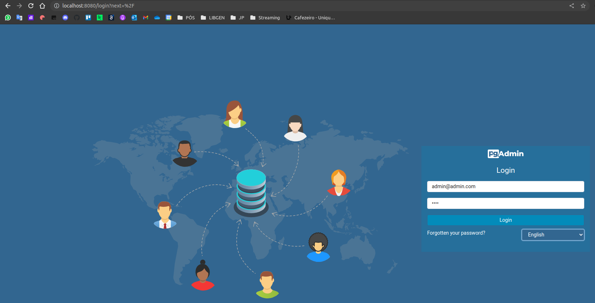
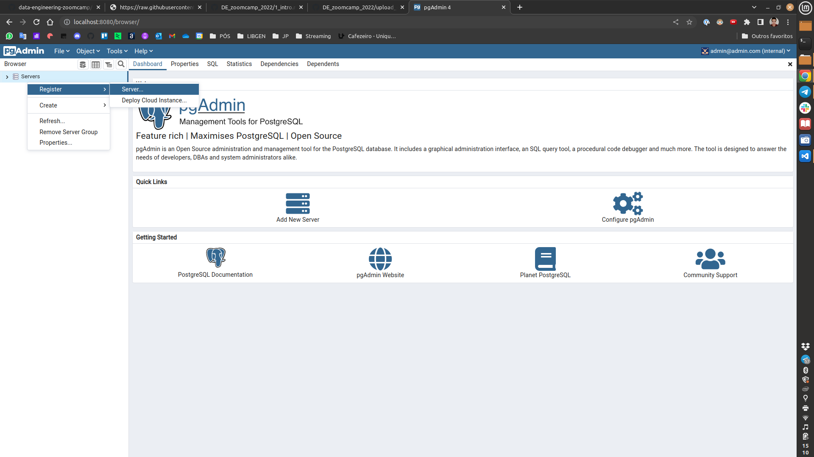
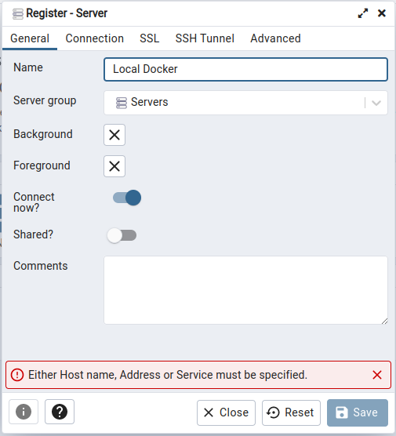
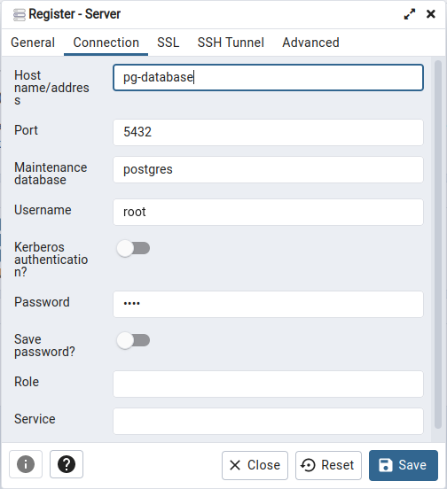
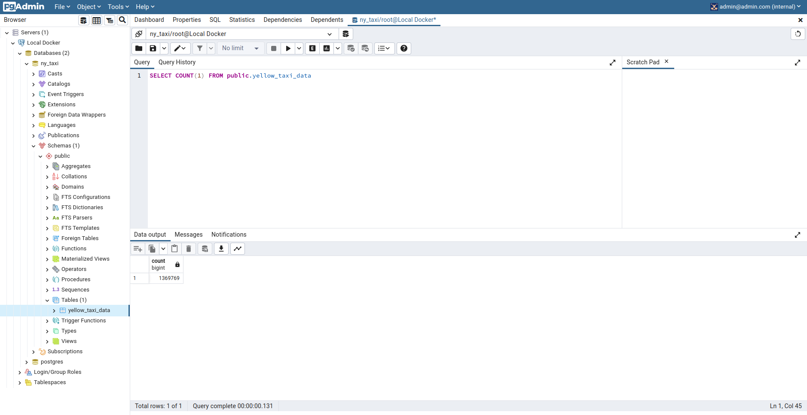
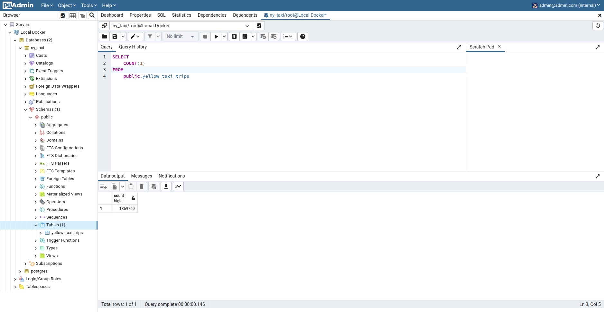

## Sumário
# Introdução à Engenharia de Dados
## Pipeline de dados
Um **_pipeline_ de dados** (**_data pipeline_**) é um conjunto de etapas que visam levar dados de uma ou mais origens a um ou mais destinos. Entre cada origem e destino, os dados passam por diversos processos (transformações e integrações) de modo a serem aplicáveis à finalidade.


## Arquitetura do projeto do curso


* [NYC TLC Dataset](https://github.com/DataTalksClub/data-engineering-zoomcamp/blob/main/dataset.md): Conjunto de dados de viagens de Táxi e Limusine de Nova Iorque. O dataset que será usado durante o curso.
* [Apache Spark](https://spark.apache.org/): Framework de código-aberto com o objetivo de processar grandes conjuntos de dados de forma paralela e distribuída.
* [Google BigQuery](https://cloud.google.com/products/bigquery/): _Data Warehouse_ sem servidor (_serverless_) que permite análises escalonáveis em _petabytes_ de dados.
* [Google Data Studio](https://marketingplatform.google.com/about/data-studio/): Ferramenta online para converter dados em _dashboards_ e relatórios informativos.
* [Apache Airflow](https://airflow.apache.org/): Plataforma de gerenciamento de fluxo de trabalho em código-aberto para _pipelines_ de Engenharia de Dados.
* [Apache Kafka](https://kafka.apache.org/): Plataforma de código-aberto para processamento de _streams_, com o objetivo de fornecer uma plataforma unificada, de alta capacidade e baixa latência para tratamento de dados em tempo real.

## Básico de Docker 
>"Docker é um conjunto de produtos de plataforma como serviço que usam virtualização de nível de sistema operacional para entregar software em pacotes chamados contêineres. Os contêineres são isolados uns dos outros e agrupam seus próprios softwares, bibliotecas e arquivos de configuração" -- [Wikipedia](https://pt.wikipedia.org/wiki/Docker_(software))

Cada **contêiner** é encapsulado e possui um sistema inteiro dentro de uma estrutura de diretório. Da perspectiva do _kernel Linux_, um contêiner é um processo com restrições: ao invés de executar um único arquivo binário, um contêiner executa uma **imagem**.

Uma **imagem** é um pacote com vários sistemas de arquivos em camadas sobrepostas, com todas as dependências necessárias para executar um processo.

Utilizar o Docker tem as seguintes vantagens:
* Facilidade de reprodução
* Testes locais
* Testes de integração (CI/CD)
* Rodar _pipelines_ em plataformas de _Cloud_ (AWS Batch, Kubernetes jobs)
* Apache Spark
* _Serverless_ (AWS Lambda, Google functions)

Os **contêineres** do Docker são voláteis (_stateless_ por natureza), ou seja, qualquer mudança dentro do contêiner **NÃO** será salvo quando o contêiner for encerrado e inicializado novamente. Para persistir os dados dentro dos contêineres é comum utilizarmos **volumes**.

Os **volumes** são diretórios externos ao contêiner, que são montados diretamente nele, e dessa forma não seguem o mesmo padrão de camadas. A principal função do volume é **persistir os dados**. Existem algumas particularidades entre os volumes e contêineres que valem a pena ser mencionadas:
* O volume é inicializado quando o contêiner é criado
* Caso ocorra de já haver dados no diretório em que o volume for montado, aqueles dados serão copiados para o volume
* Um volume pode ser reusado e compartilhado entre os contêineres
* Alterações em um volume são feitas diretamente no volume
* Alterações em um volume **não irão com a imagem** quando for feita cópia ou _snapshot_ de um contêiner
* Volumes **continuam a existir mesmo se o contêiner for deletado**

## [Video - Introduction to Docker](https://www.youtube.com/watch?v=EYNwNlOrpr0&list=PL3MmuxUbc_hJed7dXYoJw8DoCuVHhGEQb)

Para o meu Linux Mint, instalei o Docker e o Docker Compose, ambos requisitos do curso, conforme abaixo:

```bash
# Cadastrei o repositório para o pacote do Docker e a chave
echo "deb [arch=amd64] https://download.docker.com/linux/ubuntu focal stable" | sudo tee /etc/apt/sources.list.d/docker.list
curl -fsSL https://download.docker.com/linux/ubuntu/gpg | sudo apt-key add -

# Atualizei os repositórios do apt em busca de atualizações
sudo apt-get update

# Instalei as últimas versões do Docker Engine, Docker Compose e containerd
sudo apt-get install docker-ce docker-ce-cli containerd.io docker-compose-plugin

# Para corrigir os problemas com permissão para rodar o docker sem sudo
# Primeiramente adicionei um grupo chamado docker
sudo groupadd docker

# Adicionei meu usuário ao grupo
sudo usermod -aG docker $USER

# Alterei o grupo do docker.sock para o grupo docker
sudo chgrp docker /var/run/docker.sock

# E restartei o meu sistema para garantir que as modificações fizessem efeito
sudo reboot
```

Dentro do diretório da aula, foi criado um arquivo de teste chamado `pipeline.py`:

```python
import sys
import pandas as pd

print(sys.argv)
day = sys.argv[1]

print(f'job finished successfully for day={day}')
```

Ao rodar o script com `python pipeline.py <argumento>` teremos:
* `['pipeline.py', '<argumento>']`
* `job finished successfully for day=<argumento>`

Ainda no mesmo diretório, criei um arquivo chamado `Dockerfile`:

```dockerfile
# Imagem do Docker que vai servir de base
FROM python:3.9

# Prepara nossa imagem para instalar os pré-requisitos direto na instanciação do contêiner
RUN pip install pandas

# Configura o Working Directory dentro do contêiner
WORKDIR /app

# Copia o script presente na máquina, no mesmo diretório deste Dockerfile para o Working Dir do contêiner
# 1o nome é na origem (máquina local)
# 2o nome é no destino (contêiner)
COPY pipeline.py pipeline.py

# Define o que fazer quando o contêiner rodar
ENTRYPOINT ["python", "pipeline.py"]
```

Construí a imagem com:

```bash
# -t possibilita dar nome a uma imagem e associar uma tag a ela
# O nome da imagem é 'test'
# O nome da tag é 'pandas', se ela não fosse especificada seria 'latest'
docker build -t test:pandas .
```

Rodei o contêiner com um argumento no final afim de ser interpretado pelo script `pipeline.py`:

```bash
docker run -it test:pandas 2022-07-12
```

O resultado deve ser o esperado, com a lista de argumentos enviados ao script e ao final uma _string_ informando que a _job_ foi finalizada com sucesso e mostrando o argumento enviado ao rodar o contêiner.

Ao final, rodei o seguinte comando para remover de forma forçada todos os contêineres e imagens já criados:

```bash
# a flag -q traz somente os IDs
# a flag -a mostra todos os itens, até os parados/inativos

# CONTÊINERES
# 'docker ps' lista os contêineres
# 'docker rm -f' excluir forçadamente os contêineres selecionados
docker rm -f $(docker ps -qa)

# IMAGENS
# 'docker images' lista as imagens
# 'docker rmi -f' excluir forçadamente as imagens selecionadas
docker rmi -f $(docker images -qa)
```

## [Video - Ingesting NY Taxi Data to Postgres](https://www.youtube.com/watch?v=2JM-ziJt0WI&list=PL3MmuxUbc_hJed7dXYoJw8DoCuVHhGEQb)

No futuro iremos utilizar o _Apache Airflow_ que usa internamente o _PostgreSQL_.

Para rodar a versão contêinirizada do _Postgres_ é necessário passar somente algumas **variáveis de ambiente** assim como um **volume** para persistir os dados do banco de dados.

Foi criada uma pasta localmente chamada `nyc_taxi_postgres_data` para armazenar os dados de instalação do _PostgreSQL_ criado no volume do contêiner. O comando passado ao Docker pela linha de comando fica:

```bash
docker run -it \
    -e POSTGRES_USER="root" \
    -e POSTGRES_PASSWORD="root" \
    -e POSTGRES_DB="ny_taxi" \
    -v $(pwd)/nyc_taxi_postgres_data:/var/lib/postgresql/data \
    -p 5432:5432 \
    postgres:13
```

O contêiner precisa de 3 variáveis de ambiente:
* `POSTGRES_USER` é o nome de usuário para login. Por padrão é `root`
* `POSTGRES_PASSWORD` é a senha para o banco de dados. Por padrão é `root`
* `POSTGRES_DB` é o nome para o banco de dados

**IMPORTANTE: A escolha da senha e usuário acima foram só para testes. Em produção utilizar valores mais seguros.**

A flag `-v` passada para o `docker run` diz respeito ao diretório para o volume. Os dois pontos `:` separam as duas partes da sentença: 
* a primeira diz respeito ao diretório local, dentro do computador do usuário
* a segunda parte diz respeito ao diretório no contêiner criado.

**IMPORTANTE: É feito o mapeamento do diretório local, apontando para a pasta recém-criada chamada `nyc_taxi_postgres_data`. Para o comando funcionar ela tem que existir e estar corretamente mapeada na primeira parte da sentença para criação do volume.**

A flag `-p`, semelhantemente à flag `-v`, mapeia um item local à um item no contêiner. No caso, é o mapeamento de portas. O separador continua sendo o `:` e a ordem da declaração da sentença a mesma também.

A última parte é a declaração da imagem e da tag. Foi passada a imagem oficial do Docker `postgres` com a versão `13`.

---
Após configurar o _Postgres_, foi criado um _Jupyter Notebook_ chamado `upload_data.ipynb` para ler o arquivo PARQUET e exportá-lo para o _PostgreSQL_.

Utilizamos os dados do [NYC TLC Trip Record Data](https://www1.nyc.gov/site/tlc/about/tlc-trip-record-data.page), especificamente os dados do [Yellow Taxi Trip Records de Janeiro de 2021](https://d37ci6vzurychx.cloudfront.net/trip-data/yellow_tripdata_2021-01.parquet). Um dicionário de dados para entender cada campo é [disponibilizado](https://www1.nyc.gov/assets/tlc/downloads/pdf/data_dictionary_trip_records_yellow.pdf) pelo site.

O arquivo `upload_data.ipynb` completo com todas as partes detalhadas está disponível [neste link](../1_intro/1_2_intro_postgres/upload_data.ipynb).

## [Video - Connecting pgAdmin and PostgreSQL](https://www.youtube.com/watch?v=hCAIVe9N0ow&list=PL3MmuxUbc_hJed7dXYoJw8DoCuVHhGEQb&index=6)

Podemos manipular os dados pela linha de comando ou pelo Python, porém para atividades mais rotineiras ou desenvolvimento do banco de dados, é interessante acessar via alguma ferramenta desenvolvida para tal.

O [pgAdmin](https://www.pgadmin.org/) vêm para nos auxiliar nesse sentido. É uma ferramenta _web-based_ de código aberto que oferece uma interface gráfica que simplifica a criação, manutenção e uso dos objetos do banco de dados.

Assim como o _Postgres_, é possível rodar o pgAdmin com o uso de contêineres, mas para isso, é necessário colocar ambos os itens (_Postgres_ e pgAdmin) no mesmo contêiner ou então na mesma rede. Para isso, no Docker temos as **virtual networks**.

É criada então uma rede no Docker, chamada de `pg-network`:

```bash
docker network create pg-network
```

Nós vamos ter que parar o contêiner do _Postgres_ e rodar novamente passando informações para alocá-lo nessa rede criada:

```bash
# Parando o contêiner do Postgres
docker stop <id_do_contêiner_do_postgres>

# Rodando o contêiner novamente e passando os dados da rede
docker run -it \
    -e POSTGRES_USER="root" \
    -e POSTGRES_PASSWORD="root" \
    -e POSTGRES_DB="ny_taxi" \
    -v $(pwd)/nyc_taxi_postgres_data:/var/lib/postgresql/data \
    -p 5432:5432 \
    --network=pg-network \
    --name pg-database \
    postgres:13
```

Agora podemos rodar o contêiner do pgAdmin:

```bash
docker run -it \
    -e PGADMIN_DEFAULT_EMAIL="admin@admin.com" \
    -e PGADMIN_DEFAULT_PASSWORD="root" \
    -p 8080:80 \
    --network=pg-network \
    --name pgadmin \
    dpage/pgadmin4
```

O contêiner precisa de 2 variáveis de ambiente:
* `PGADMIN_DEFAULT_EMAIL` é o e-mail para login. Usamos `admin@admin.com`
* `PGADMIN_DEFAULT_PASSWORD` é a senha para login. Usamos `root`

**IMPORTANTE: A escolha da senha e usuário acima foram só para testes. Em produção utilizar valores mais seguros.**

* O pgAdmin é uma ferramenta web e sua porta padrão é 80 no contêiner. Mapeamos localmente para a nossa porta 8080.
* Assim como o contêiner do _Postgres_, especificamos a rede e o nome do objeto nessa rede
* A imagem do Docker utilizada foi a [`dpage/pgadmin4`](https://hub.docker.com/r/dpage/pgadmin4/)

Agora nós somos capazes de carregar o pgAdmin em um _browser_ acessando `localhost:8080`. Usando o e-mail e a senha passados para o contêiner, conseguimos logar na ferramenta.



Clicando com o botão direito do mouse em _Servers_, selecionamos _Register > Server..._



Em _General_, damos um nome ao servidor e em _Connection_ adicionamos o mesmo nome (_hostname_), usuário e senha que foram informados na criação do contêiner.





Clicamos então em _Save_. Agora estaremos conectados ao servidor com o banco de dados utilizado no vídeo anterior.



## [Video - Dockerizing the Ingestion Script](https://www.youtube.com/watch?v=B1WwATwf-vY&list=PL3MmuxUbc_hJed7dXYoJw8DoCuVHhGEQb)

Agora vamos exportar o _Jupyter Notebook_ que faz a ingestão dos dados para o _Postgres_, para um script em Python padrão e fazer com que o Docker o execute.

### Exportando e testando o script
Primeiro, foi necessário instalar o jupyter e o nbconvert no meu ambiente virtual. Visto que estou utilizando o Linux e a instalação do Python foi feita sem o Anaconda.

```bash
pip install jupyter nbconvert
```

Em seguida, é possível converter o _notebook_ para um script `.py` com o comando abaixo.

```bash
jupyter nbconvert --to=script upload_data.ipynb
```

Após a conversão, foi necessário remover tudo o que não precisamos para o script e formatá-lo para as convenções adotadas pela comunidade. O arquivo foi renomeado para `ingest_data.py` e algumas modificações foram adicionadas:
* Usamos o [argparse](https://docs.python.org/3/library/argparse.html) para lidar com os seguintes argumentos, passados pela linha de comando:
    * username
    * password
    * hostname
    * port
    * database name
    * table name
    * URL para o arquivo PARQUET
* A _engine_ que criamos deve suportar receber esses argumentos
    ```python
    engine = create_engine(f'postgresql://{user}:{password}@{host}:{port}/{db}')
    ```
* Também fizemos o download do arquivo PARQUET usando a URL passada como argumento

O arquivo `ingest_data.py` completo com todas as partes detalhadas está disponível [neste link](../1_intro/1_2_intro_postgres/ingest_data.py).

Para testar o script, foi necessário deletar a tabela que havia sido criada pelos métodos anteriores. No pgAdmin, foi necessário executar o seguinte comando:

```sql
DROP TABLE public.yellow_taxi_data
```

Após isso, foi possível testar o script com o comando:

```bash
python ingest_data.py \
    --user=root \
    --password=root \
    --host=localhost \
    --port=5432 \
    --db=ny_taxi \
    --table_name=yellow_taxi_trips \
    --url="https://d37ci6vzurychx.cloudfront.net/trip-data/yellow_tripdata_2021-01.parquet"
```
**IMPORTANTE: Note que mudamos o nome da tabela de `yellow_taxi_data` para `yellow_taxi_trips`.**

Após o processo finalizar no _terminal_, verificamos se o processo rodou com êxito ao verificar as quantidades na nova tabela pelo pgAdmin.



### Dockerizando o script

Criamos agora um _Dockerfile_ dentro do diretório do script `ingest_data.py` e criamos uma nova imagem que vai cuidar da execução do script.

```bash
FROM python:3.9.1

# Precisamos garantir que haja o wget para baixar o arquivo
RUN apt-get install wget

# psycopg2 é um adaptador de Postgres para Python e o sqlalchemy precisa dele
RUN pip install pandas sqlalchemy pyarrow psycopg2-binary

WORKDIR /app
COPY ingest_data.py ingest_data.py

# Cria o diretório para armazenar os arquivos de origem
RUN mkdir -p ./nyc_taxi_data

ENTRYPOINT [ "python", "ingest_data.py" ]
```

**IMPORTANTE: Para que o script rode sem erros, é necessário que exista um diretório para armazenar o arquivo baixado com os dados da origem. Esse diretório é criado na linha `RUN mkdir -p ./nyc_taxi_data` acima.**

Construindo a imagem com:

```bash
docker build -t taxi_ingest:v001 .
```

E rodando o comando para usar a imagem na criação de um contêiner:

```bash
docker run -it \
    --network=pg-network \
    taxi_ingest:v001 \
    --user=root \
    --password=root \
    --host=pg-database \
    --port=5432 \
    --db=ny_taxi \
    --table_name=yellow_taxi_trips \
    --url="https://d37ci6vzurychx.cloudfront.net/trip-data/yellow_tripdata_2021-01.parquet"
```

* Nós precisamos passar a rede para o Docker encontrar o contêiner com o _Postgres_ em execução. **Este argumento tem que ser passado antes do nome da imagem**
* É necessário apontar o nome do contêiner que possui o _Postgres_ em execução
* Já que não mudamos o nome da tabela entre a execução manual do script (para os testes) e a execução do script pelo Docker, não precisamos DROPAR a tabela antes, visto que o script irá substituir a tabela se já houver uma com o mesmo nome no banco de dados.